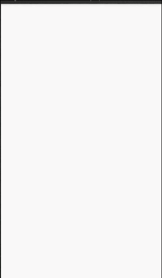

- 之前做过一个侧拉删除效果,用到了粒子效果.最近在看Material Design,尝试着把侧拉删除效果加了进去
- Material Design 非常友好的完成了ViewPager和TabLayout的绑定,代码里,我使用Fragment填充ViewPager,当然暂时没去抽取啥的,只是一个作为学习的项目,
- 最开始在Fragment中使用ListView填充frament,然后发现toolbar没有隐藏的效果,后来一查才发现自己naive了,必须用 RecyclerView 这类具有滑动效果的控件才行
- 过程中当然遇到很多坑,不过最大的坑在于触摸事件的传递,由于Viewpager会拦截左右滑动的手势,而侧拉删除必须要获取左右滑动的事件,所以在SwipeLayout中重写了dispatchTouchEvent来解决这个问题,当然也限定了边界
- ReciclerView的条目之间没有间隔线,工程里使用了张鸿阳博客里的代码,FloatingActionButton的旋转动作使用了张兴业博客里的代码,在这里非常感谢两位张大哥及其他高质量的博客,帮我解决了很多的问题

- 
- 参考的博客(有些博客地址忘了,实在抱歉):
- http://blog.csdn.net/lmj623565791/article/details/45059587
- http://blog.csdn.net/xyz_lmn/article/details/48055919

- 使用的粒子效果地址:
- https://github.com/835127729/ViewExplosion